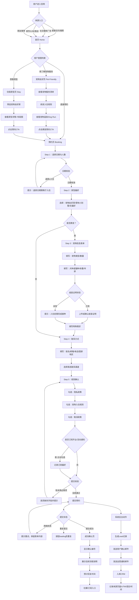
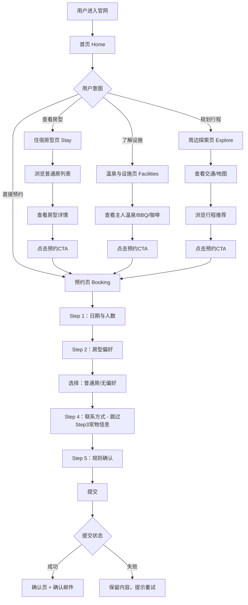
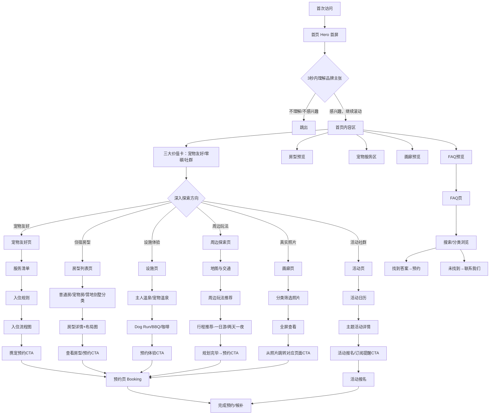
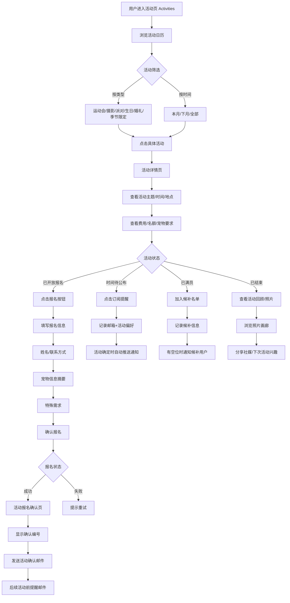
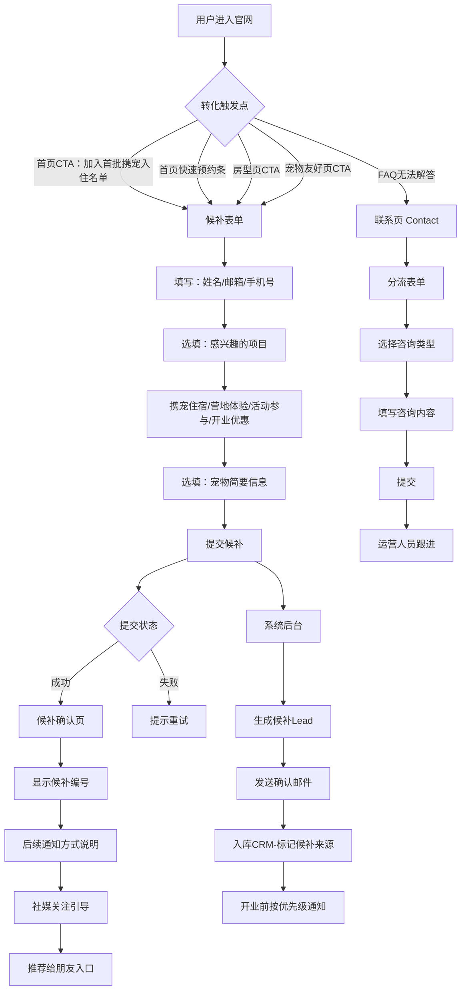
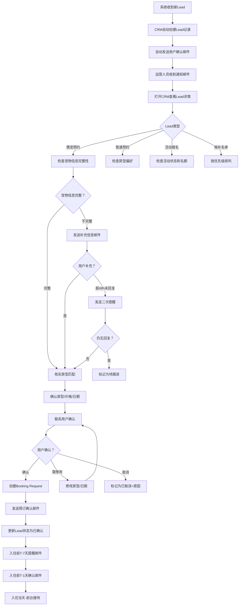
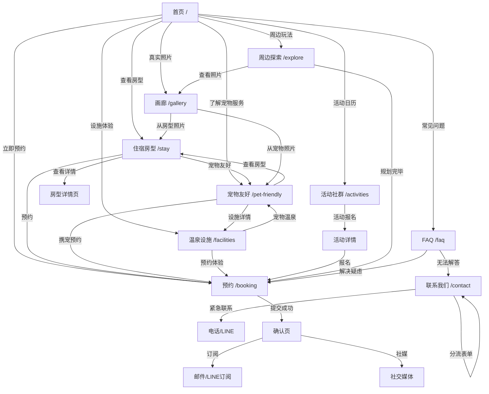
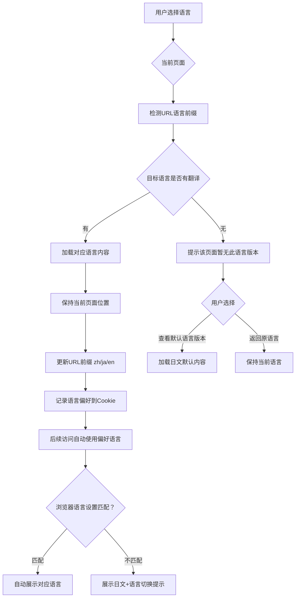

# 福岛岳温泉零碳宠物营地 — User Flow 可视化流程图

> 补充 PRD §2.4 端到端流程描述，基于 PRD 各章节需求梳理

---

## 一、核心用户流程总览

| # | 流程名称 | 核心用户 | 对应PRD章节 |
|---|---------|---------|-----------|
| 1 | 携宠预约流程 | 携宠家庭 | §2.4 / PG-10 |
| 2 | 普通住宿预约流程 | 普通温泉客 | PG-10 |
| 3 | 信息浏览与探索流程 | 所有访客 | §2.3 / §4 |
| 4 | 活动报名流程 | 宠物社群/KOL | PG-06 |
| 5 | 候补/订阅流程 | 兴趣用户 | PG-01 / PG-10 |
| 6 | 后台Lead跟进流程 | 运营人员 | §8 / §14 |

---

## 二、携宠预约流程（核心主流程）

> 携宠家庭从进入官网到完成预约的完整路径

---

## 三、普通住宿预约流程

> 不携宠用户的精简预约路径

---

## 四、信息浏览与探索流程

> 用户从发现到形成决策的信息消费路径

---

## 五、活动报名流程

> 宠物社群/KOL 参加主题活动的路径

---

## 六、候补/订阅流程（MVP阶段核心转化）

> 2026年8月开业前，承接所有兴趣用户的低门槛转化路径

---

## 七、后台Lead跟进流程

> 运营人员从收到Lead到完成确认的闭环

---

## 八、用户决策漏斗（信息→转化）

> 用户从发现到转化的心理阶段与触点对应

```mermaid
flowchart LR
    subgraph DISCOVER[发现阶段]
        D1[SEO/社媒/广告/推荐]
        D2[进入首页]
        D3[3秒理解品牌主张]
    end

    subgraph INTEREST[兴趣阶段]
        I1[浏览三大价值卡]
        I2[查看宠物服务/设施]
        I3[查看画廊真实照片]
    end

    subgraph EVALUATE[评估阶段]
        E1[比较房型/价格]
        E2[阅读入住规则]
        E3[查看FAQ解答疑虑]
        E4[规划交通/行程]
    end

    subgraph CONVERT[转化阶段]
        C1[进入预约表单]
        C2[填写5步信息]
        C3[确认规则]
        C4[提交预约/候补]
    end

    subgraph RETURN[复访阶段]
        R1[收到确认邮件]
        R2[订阅活动通知]
        R3[社媒持续关注]
        R4[朋友推荐/二次访问]
    end

    D1 --> D2 --> D3
    D3 --> I1
    I1 --> I2 --> I3
    I3 --> E1
    E1 --> E2 --> E3 --> E4
    E4 --> C1
    C1 --> C2 --> C3 --> C4
    C4 --> R1
    R1 --> R2 --> R3 --> R4
    R4 -->|口碑传播| D1
```

---

## 九、页面跳转关系图

> 各页面之间的导航关系与CTA导向

---

## 十、多语言切换流程

> 用户在不同语言间切换的信息保持逻辑

---

*流程时间：2026年6月*
*工具：Mermaid流程图*
*说明：以上流程图可直接嵌入PRD文档，也可导出为PNG/SVG用于设计评审*
